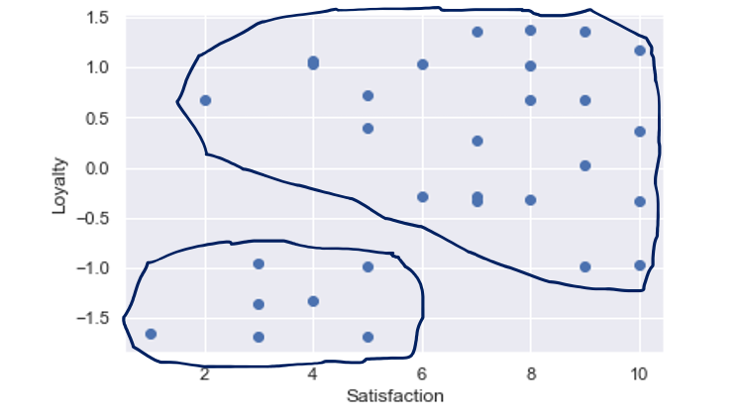
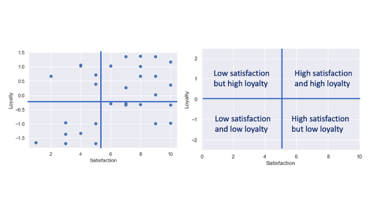
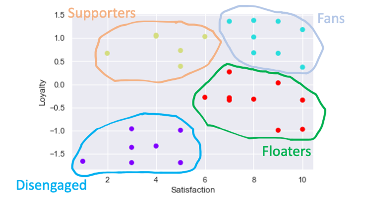

# Customer Segmentation Project (K-Means Clustering)

## Project Overview 
The goal of the project was to provide insight to a business by identifying clusters, or groups, of customers based on data relating to customer satisfaction and brand loyalty. 

The project required skills and knowledge in the following areas:
* Data Analysis
* Data Visualisation
* Unsupervised Machine Learning (K-Means Clustering)
* Statistics
* Problem Solving
* Business Awareness and Understanding
## Language and Libraries Used
**Python Version:** 3.7
**Libraries:** Pandas, numpy, matplotlib, seaborn, scikit-learn
**Data:** The raw data was provided by [365 Data Science](https://365datascience.com) and this project was completed as part of ['The 365 Data Science Program'](https://365datascience.com)
## Exploratory Data Analysis
1. The first step was to understand the business meaning of the data and get familiar with what the data entailed. 
2. I then plotted the data to see if any trends, patterns or clusters immediately stood out. There were two clusters that could loosely be defined as:
  * Low satisfaction and low loyalty. 
  * Higher loyalty with a complete range of satisfaction values.

3. Next, I split the graph into four squares to see if this would help with data interpretation… 

4. ... and it did! There were clearly more/different clusters than the 2 clusters I had identified manually so further cluster solution analysis was required.
## Cluster Analysis
* An initial K-Means clustering attempt revealed that the satisfaction variable needed to be scaled.
* I then explored the various K-Means solutions, identified different customer groups and decided on a cluster solution.

## Provided Business Insight
* I summarised how the insight gleaned from the customer segmentation could be used as a starting for further analysis and for informing marketing and promotional strategies. 
## Summary
* By analysing the data and trying different K-Means clustering solutions I was able to turn quantitative data into valuable business insight.
* 4 different groups of customers were identified, and this information can be used by the business as a base for further analysis and/or for informing strategic business decisions.
